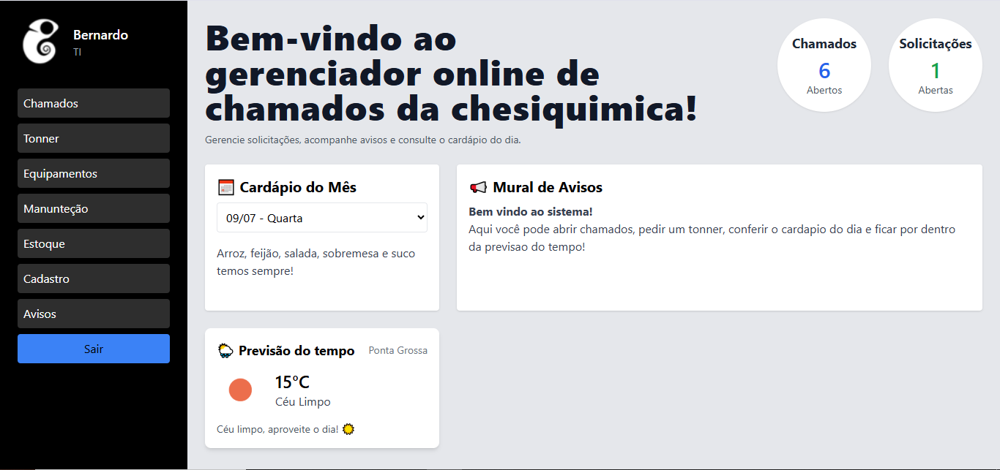

# 🧑‍💻 Sistema de Gerenciamento de Chamados - Chesiquimica

Bem-vindo ao **sistema online de chamados da Chesiquimica**! Esta aplicação foi desenvolvida para facilitar o controle de chamados técnicos, solicitações de tonner, visualização de cardápio e previsão do tempo — tudo em uma única interface simples, moderna e intuitiva.

---

## ✨ Funcionalidades

- 📌 **Dashboard Interativo** com resumo dos chamados e solicitações.
- 📝 **Abertura e listagem de chamados técnicos**.
- 🖨️ **Solicitação de Tonner** com envio automático de e-mail para o setor responsável.
- 🍛 **Cardápio diário** da empresa, integrado ao frontend.
- 🌤️ **Previsão do tempo em tempo real**, integrada com a API da OpenWeatherMap.
- 🔐 **Autenticação de usuário** com controle de sessão.
- ⚙️ Painéis personalizados por **setor** (ex: TI, Administrativo, etc).

---

## 💻 Print do Sistema

### 🎯 Tela Principal - Dashboard

O dashboard exibe os dados mais relevantes de forma clara e objetiva:

- Quantidade de chamados abertos
- Quantidade de solicitações pendentes
- Cardápio da empresa para o dia atual
- Mural de avisos personalizável
- Previsão do tempo para a cidade da empresa (ex: Ponta Grossa)

---

## 🛠️ Tecnologias Utilizadas

| Tecnologia | Função |
|------------|--------|
| `PHP` | Lógica backend e controle de sessões |
| `MySQL` | Banco de dados relacional |
| `Tailwind CSS` | Estilização moderna e responsiva |
| `JavaScript` | Interatividade no frontend |
| `OpenWeatherMap API` | Dados de clima em tempo real |
| `Google Sheets API` (opcional) | Integração com dados externos |
